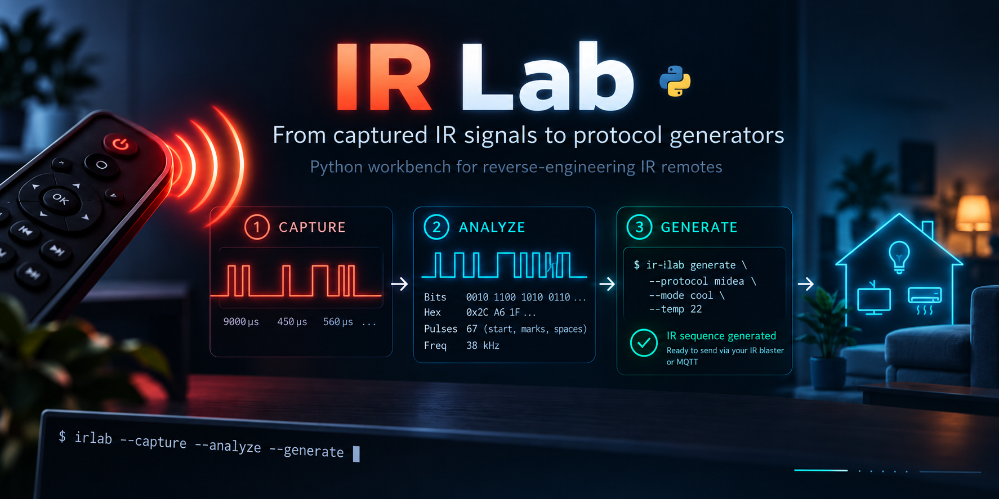

# IR Lab

[](https://github.com/Edsol/ir-lab/actions/workflows/ci.yaml)
[](LICENSE)
[](https://www.python.org/downloads/)

**From captured IR signals to protocol generators.**

A Python workbench to capture, inspect and replay commands from IR remotes.
Currently focused on reverse-engineering air conditioner protocols and
generating their commands for Home Assistant.

Capture and analysis are not limited to air conditioners: you can also study
IR remotes for TVs, fans, set-top boxes, amplifiers and other devices. Learning
and replay depend on your blaster's support for the signal; generating new
commands requires a protocol-specific generator. The generators currently
included cover Midea and Electra air conditioner protocol families.

## Why IR Lab?

Air conditioners are the current focus because their remotes often send the
**entire state** in each IR message:
mode, temperature, fan speed and swing. Saving one code for every combination
can mean collecting hundreds of codes.

IR Lab helps you capture controlled samples, find which bits change, and turn
those findings into a **protocol generator**. Once a protocol is understood and
verified, you can generate supported states you never captured individually.

This is the reverse-engineering workbench. For everyday Home Assistant climate control,
use [IRBridge](https://github.com/Edsol/irbridge), the separate integration where
the verified generators are used.

```
physical remote
      |  ir-lab capture / learn      (acquisition over MQTT)
      v
data/remotes.json                    (samples: tuya + raw + analysis)
      |  ir-lab compare / analyze    (which bits move?)
      v
ir_lab/generators/<protocol>.py      (the protocol, in Python)
      |  port
      v
IRBridge                             (Home Assistant, codes generated on the fly)
```

## What you can do

- **Capture:** learn individual commands or work through a YAML session, with
  an interactive wizard, tags and multiple samples per command.
- **Inspect:** decode Tuya payloads into raw timings, frames, bits and hex;
  compare commands while keeping the original data and decoding errors.
- **Verify:** replay captured codes through MQTT and generate new codes with
  the Midea and Electra generators.
- **Cross-check:** query the Tuya Cloud IR library to compare known codes
  against your samples (optional, requires credentials).

Everything runs locally from the CLI, with samples stored in JSON.

## A small discovery: where is the temperature?

Keep mode at `cool` and fan at `auto`, then capture a temperature sweep.
These three rows come from the [verified Midea sweep](docs/protocol_midea.md):

| Temperature | Frame 1 bytes | Temperature byte (B1) |
|---|---|---|
| 21 °C | 86 **60** 07 0A | `0x60` |
| 22 °C | 86 **E0** 07 0A | `0xE0` |
| 23 °C | 86 **10** 07 0A | `0x10` |

The second byte changes, but it does not count up in ordinary hexadecimal.
For this mode, subtract 15 from the temperature, reverse the resulting four
bits, and place them in the high nibble: at 22 °C, `7 → 0111 → 1110 → 0xE0`.

This is an excerpt of the documented analysis, with the rolling-counter bit
normalised to zero and the fixed three-bit frame tail omitted. The second
frame also has a temperature-dependent field; the full protocol notes describe
both. A generator must reproduce the complete message, then be verified on the
device.

To compare your own captured commands:

```bash
ir-lab compare --remote midea_bedroom --commands cool_21_auto cool_22_auto cool_23_auto
```

## Supported generators

| Protocol | Devices | Temp | Fan | Swing |
|---|---|---|---|---|
| `midea` | Ferroli, Midea | 16-30 C | auto only | not yet |
| `electra` | Beko, AUX, Electrolux, Frigidaire | 16-32 C | auto/high/mid/low | vertical |

Midea fan speed has not been isolated yet: it needs samples with mode and
temperature held fixed and only the fan speed changing.

## Requirements

- **Python 3.11+** for the CLI.
- **For capture and replay:** an MQTT broker, Zigbee2MQTT, and a compatible IR
  blaster exposing `learn_ir_code` and `ir_code_to_send`. The setup below uses
  the Tuya iH-F8260.
- **For learning a new protocol:** the physical remote and the target device
  to verify captured and generated commands.

Decoding, encoding, analysing saved samples and generating codes work offline,
without a blaster or MQTT connection. Sending a generated code requires the
hardware setup above.

## Installation

```bash
git clone https://github.com/Edsol/ir-lab.git
cd ir-lab
python3 -m venv .venv
source .venv/bin/activate
pip install -e .
```

For development:

```bash
pip install -e ".[dev]"
pytest
```

## Configuration

For capture and replay, configure your MQTT connection and emitter:

```bash
cp config.example.yaml config.yaml
```

Edit `config.yaml`:

```yaml
mqtt:
  host: 192.168.1.10
  port: 1883

emitters:
  ir_blaster_battery:
    friendly_name: "IR Blaster (Battery)"
    topic_state: "zigbee2mqtt/IR Blaster (Battery)"
    topic_set: "zigbee2mqtt/IR Blaster (Battery)/set"
```

For the Tuya iH-F8260 over Zigbee2MQTT, learning goes through `learn_ir_code`
and sending through `ir_code_to_send` on the `/set` topic.

## Quick start

### Interactive wizard

```bash
ir-lab wizard
```

The wizard asks for the MQTT emitter, remote, brand, device type, command name,
tags and sample count. For every sample it puts the blaster into learning mode,
waits for `learned_ir_code`, converts the Tuya code to raw, analyses it and
stores everything in `data/remotes.json`.

### Single acquisition

```bash
ir-lab learn \
  --remote midea_bedroom \
  --command cool_22_auto \
  --brand Midea \
  --device-type climate \
  --tags mode=cool,temperature=22,fan=auto \
  --samples 2
```

### Sequential acquisition

```bash
ir-lab capture --session sessions/midea_cool_sweep.yaml --samples 2
```

This is the recommended mode for studying a protocol: change one variable at a
time and capture several samples of the same command.

### List, send, analyse

```bash
ir-lab list
ir-lab send --remote midea_bedroom --command cool_22_auto
ir-lab analyze --remote midea_bedroom
ir-lab compare --remote midea_bedroom --commands cool_21_auto cool_22_auto cool_23_auto
```

### Generating without a remote

Once a protocol is understood, codes are produced without the physical remote:

```bash
ir-lab generate --protocol midea --mode cool --temp 22
ir-lab generate --protocol electra --mode heat --temp 20 --fan high
```

### Offline decoding

```bash
ir-lab decode --tuya "CUsjhRFhApgG..."
ir-lab encode --raw "9000,4500,600,600,600,1680"
```

Note: the current encoder uses uncompressed literal blocks. The resulting code
is longer than the learned one, but useful for experiments and controlled
round-trips.

## Storage format

The main file is:

```text
data/remotes.json
```

A command can hold several samples. Every sample keeps `tuya`, `raw`,
`analysis`, a timestamp and any decoding errors.

## Layout

```text
config.example.yaml              Example MQTT config
config.yaml                      Local config, git-ignored
sessions/                        Sequential acquisition sessions
data/remotes.json                Local database, git-ignored
ir_lab/cli.py                    CLI commands
ir_lab/mqtt_client.py            MQTT bridge to Zigbee2MQTT
ir_lab/tuya_codec.py             Tuya base64 <-> raw timings codec
ir_lab/raw_analyzer.py           Header/bit/frame/hex analysis
ir_lab/storage.py                JSON storage
ir_lab/prompts.py                InquirerPy prompt wrapper
ir_lab/generators/               Reverse-engineered protocols
ir_lab/tuya_cloud.py             Tuya Cloud IR library client
docs/protocol_midea.md           Midea protocol analysis
SKILL.md                         Guide for analysing captures with an LLM
```

## Analysing captures with an LLM

An LLM can help propose field mappings and checksum hypotheses from frame
diffs. [`SKILL.md`](SKILL.md) is a tool-agnostic guide: provide it alongside
your `ir-lab compare` output, then check each hypothesis against additional
samples and verify generated commands on the device.

## Tuya Cloud (optional)

`ir_lab/tuya_cloud.py` queries Tuya's official IR library, useful for comparing
your own samples against a brand's known codes. It needs credentials from a
project on [iot.tuya.com](https://iot.tuya.com), in a `.env` file that is
**never committed**:

```bash
ACCESS_ID=...
ACCESS_SECRET=...
```

## Relationship with IRBridge

IR Lab is the workbench; [IRBridge](https://github.com/Edsol/irbridge) is the
product. A new protocol always follows the same path: captured and analysed
here, and once the generator is verified, ported to IRBridge as a
`ClimateGenerator`.

The two projects stay separate on purpose. Reverse-engineering is a rare,
terminal-bound activity; the integration has to be installable through HACS
without dragging the lab tooling along.

## Roadmap

- [x] Verified Midea/Ferroli generator
- [x] Electra/AUX/Beko generator
- [ ] Midea fan and swing (needs samples)
- [ ] More protocols: LG, Daikin, Samsung, Panasonic
- [ ] FastLZ compression in the Tuya encoder
- [ ] Home Assistant add-on, to capture without a PC on the same network

## Notes on the Tuya codec

The bundled codec is written for the lab and aims to be readable. It decodes
learned Tuya codes into raw timings. The encoder produces valid payloads using
uncompressed literal blocks, useful for experiments.

Useful references:

- IRTuya: https://github.com/pasthev/irtuya
- Sensus: https://pasthev.github.io/sensus/
- mildsunrise's Tuya IR format notes: https://gist.github.com/mildsunrise/1d576669b63a260d2cff35fda63ec0b5
- InquirerPy: https://inquirerpy.readthedocs.io/

## Contributing

See [CONTRIBUTING.md](CONTRIBUTING.md). The most useful contribution is a new
protocol: if you own an unsupported air conditioner, capturing the samples and
opening an issue with the JSON file is already half the work.

## License

GPL-3.0-or-later — see [LICENSE](LICENSE) and [NOTICE.md](NOTICE.md).
